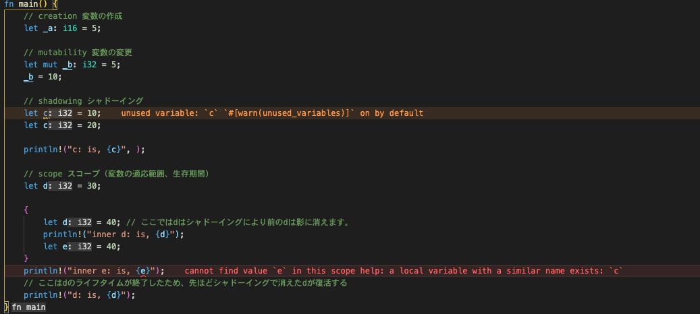

# 2日目

今日も頑張ります！！

変数について、

変数について学習する内容は

- 変数の作成
- 変数の変更
- シャドーイング（上書きと表現してみます）
- スコープ

の4つです。

``` rust
fn main() {
    // creation 変数の作成
    let _a: i16 = 5;

    // mutability 変数の変更
    let mut _b: i32 = 5;
    _b = 10;

    // shadowing シャドーイング
    let c = 10;
    let c = 20;

    println!("c: is, {c}", );

    // scope スコープ（変数の適応範囲、生存期間）
    let d = 30;

    {
        let d = 40; // ここではdはシャドーイングにより前のdは影に消えます。
        println!("inner d: is, {d}");
        let e = 40;
    }
    println!("inner e: is, {e}");
    // ここはdのライフタイムが終了したため、先ほどシャドーイングで消えたdが復活する
    println!("d: is, {d}");
}
```



これ便利だな。エラー分とか警告を見やすくなっている。

```rust
fn main() {
    // データ型に関する内容
    // boolean
    // 真偽値に関するデータ型
    let _b1: bool = true;

    // unsigned integers
    // 符号なしの整数値
    let _i1: u8 = 1;
    let _i2: u16 = 1;
    let _i3: u32 = 1;
    let _i4: u64 = 1;
    let _i5: u128 = 1;

    // signed integers
    // 符号ありの整数値
    let _i7: i8 = 1;
    let _i8: i16 = 1;
    let _i9: i32 = 1;
    let _i10: i64 = 1;
    let _i11: i128 = 1;

    // floating point numbers
    // 浮動小数点の数
    let _f1: f32 = 1.0;
    let _f2: f64 = 1.0;

    // platform specific integers
    // プラットフォームに合わせた整数
    let _p1: isize = 1;
    let _p2: usize = 1;

    // characters, &str, and strings
    // キャラクター型、スライス文字列、文字列型
    let _c1: char = 'c';
    let _s1: &str = "hello";
    let _s2: String = String::from("world");

    // arrays
    // 配列
    let _a1 = [1, 2, 3, 4, 5];
    let _i1 = _a1[4];

    // tuples
    // タプル
    let _t1 = (1, 2, 3);
    let _t1 = (5, 5.0, "5");

    let _s1 = _t1.2;
    let (_i1, _f1, _s1) = _t1;

    let _unit = ();
    // タプルのユニットを宣言

    // Type aliasing
    // 型定義を変数にすることも可能
    type Age = u8;
    let _a1: Age = 57;
}
```

結構綺麗にまとめられている。

staticやconstによる定数

```rust
// グローバルスコープで定数やスタティックな変数、定数を定義する
const MAX_PLAYERS: u8 = 10;
static CASINO_NAME: &str = "Rusty Casino";

fn main() {
    let _a = 10;
    let _b = 10;

    let _c = CASINO_NAME;
    let _d = CASINO_NAME;

    let _e = MAX_PLAYERS;
    println!("{_a}");
    println!("{_b}");
    println!("{_c}");
    println!("{_d}");
    println!("{_e}");
}
```